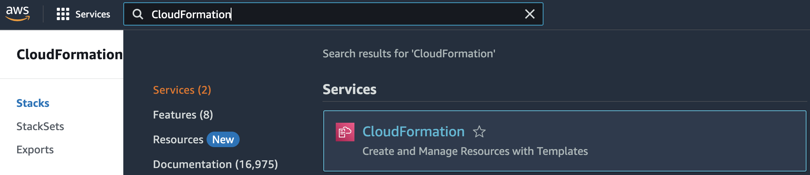
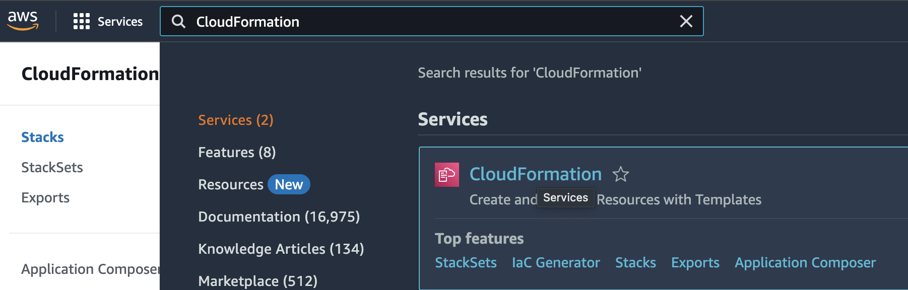
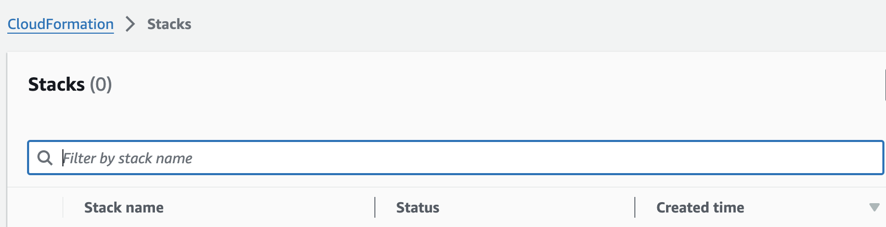

# AWS / CloudFormation / CloudFormation Plaintext Parameters

## Quick Info

| | |
|-|-|
| **Plugin Title** | CloudFormation Plaintext Parameters |
| **Cloud** | AWS |
| **Category** | CloudFormation |
| **Description** | Ensures CloudFormation parameters that reference sensitive values are configured to use NoEcho. |
| **More Info** | CloudFormation supports the NoEcho property for sensitive values, which should be used to ensure secrets are not exposed in the CloudFormation UI and APIs. |
| **AWS Link** | https://docs.aws.amazon.com/AWSCloudFormation/latest/UserGuide/parameters-section-structure.html |
| **Recommended Action** | Update the sensitive parameters to use the NoEcho property. |

## Detailed Remediation Steps
1. Log into the console.
2. Ensure you are in the region with the failing test.
3. Search services and find Cloudformation.
4. Click on Stacks.
5. Search for the offending stack.
6. In the stack details pane, choose Update.
7. Select Use current template
8. Add "NoEcho" to any lines with sensitive information. 
9. When you are satisfied with your changes, choose Update stack.