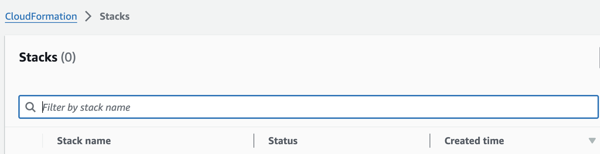

# AWS / CloudFormation / CloudFormation Admin Priviliges
## Quick Info
| | |
|-|-|
| **Plugin Title** | CloudFormation Admin Priviliges |
| **Cloud** | AWS |
| **Category** | CloudFormation |
| **Description** | Ensures no AWS CloudFormation stacks available in your AWS account has admin privileges. |
| **More Info** | A service role is an AWS Identity and Access Management (IAM) role that allows AWS CloudFormation to make calls to resources in a stack on your behalf. You can specify an IAM role that allows AWS CloudFormation to create, update, or delete your stack resources |
| **AWS Link** | https://docs.aws.amazon.com/AWSCloudFormation/latest/UserGuide/using-iam-servicerole.html |
| **Recommended Action** | Modify IAM role attached with AWS CloudFormation stack to provide the minimal amount of access required to perform its tasks |
## Detailed Remediation Steps
1. Log into the console.
2. Ensure you are in the region with the failing test.
3. Search services and find Cloudformation.
4. Click on Stacks.
5. Search for the offending stack.
6. In the stack details pane, choose Update.
7. Select Use current template
8. In the Configure stack options page, update the permissions applied to the stack
9. When you are satisfied with your changes, choose Update stack.